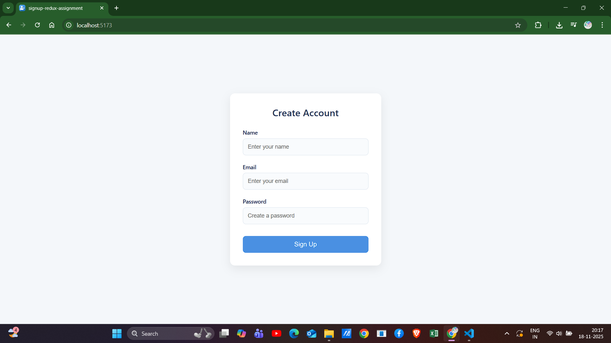
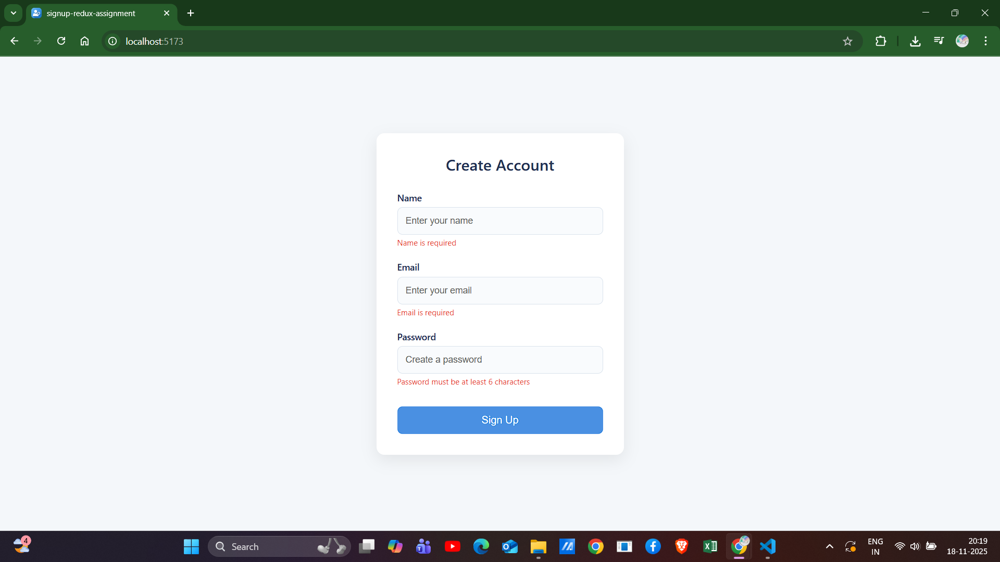
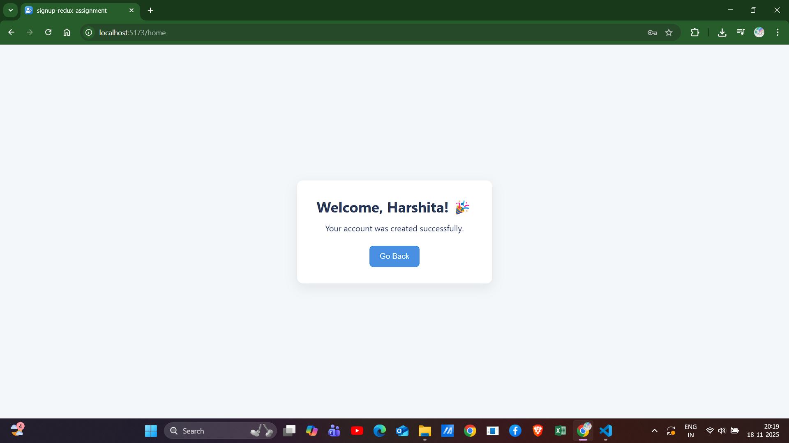

# Signup Form with Redux (React + Vite)

A clean and modern signup form built using **React**, **Redux Toolkit**, and **Vite**.  
This project demonstrates component-based architecture, global state management, and simple routing, wrapped in a polished UI.

---

## 🚀 Features

### ✔ Signup Form
- Name, Email, Password fields  
- Inline validation  
- Error messages  
- Modern UI with rounded card layout and soft color palette  

### ✔ Redux Toolkit Integration
- `signupStart`, `signupSuccess`, `signupFailure` actions  
- Global state for user data and loading state  
- Simulated async signup using `setTimeout`  
- Clean slice + store setup  

### ✔ Routing
- `/` → Signup Page  
- `/home` → Welcome Page  

---

## 📁 Folder Structure

 ```
src/
│
├── app/
│ └── store.js
│
├── features/
│ └── auth/
│ └── authSlice.js
│
├── components/
│ └── Signup/
│ ├── Signup.jsx
│ ├── Signup.css
│ └── index.js
│
├── pages/
│ └── Home/
│ ├── Home.jsx
│ └── Home.css
│
├── utils/
│
├── hooks/
│
├── App.jsx
├── main.jsx
└── index.css

```

## 🛠 Tech Stack

- **React (Vite)**
- **Redux Toolkit**
- **React Router DOM**
- **Plain CSS**
- **JavaScript (ES6+)**

---

## 📦 Installation & Setup

### 1️⃣ Clone the repository
```bash
git clone https://github.com/Harshita2020/signup-redux-assignment.git
```

2️⃣ Install dependencies
```bash
npm install
```

3️⃣ Run the development server
```bash
npm run dev
```

🧪 How It Works

User fills the form → clicks Sign Up

Basic validation runs

Redux dispatches signupStart()

A simulated network delay (800ms) runs

On success → signupSuccess(userData)

User navigates to /home

Home page reads Redux state using useSelector and displays:
“Welcome, {name}! 🎉”

## 📸 Screenshots

### Signup Form (Main UI)


### Validation Errors


### Success Page



🧑‍💻 Author

Created by Harshita as part of an interview assignment requiring a Signup component with Redux Toolkit.

Thank you for reviewing the project! ⭐
